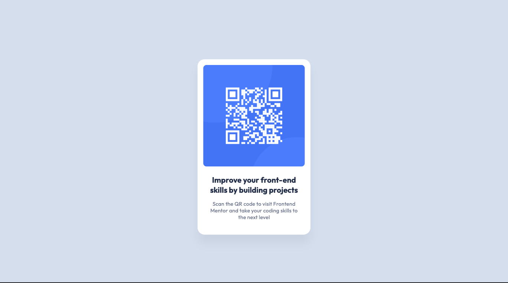

# Frontend Mentor - QR code component solution

This is a solution to the [QR code component challenge on Frontend Mentor](https://www.frontendmentor.io/challenges/qr-code-component-iux_sIO_H). Frontend Mentor challenges help you improve your coding skills by building realistic projects.

## Table of contents

- [Frontend Mentor - QR code component solution](#frontend-mentor---qr-code-component-solution)
  - [Table of contents](#table-of-contents)
  - [Overview](#overview)
    - [Screenshots](#screenshots)
      - [Desktop](#desktop)
      - [Mobile](#mobile)
    - [Links](#links)
  - [Author](#author)

## Overview

### Screenshots

#### Desktop

#### Mobile

### Links

- Solution URL: [Frontend Mentor](https://www.frontendmentor.io/solutions/qr-code-component-using-css-flexbox-and-variables-cycqJEcAAA)
- Live Site URL: [Website](https://iddahadev.github.io/frontend-mentor-qrcode/)

## Author

- Frontend Mentor - [@iddahadev](https://www.frontendmentor.io/profile/iddahadev)
- Frontend Masters - [@Iddahadev](https://frontendmasters.com/u/Iddahadev)
- Twitter - [@iddahadev](https://x.com/iddahadev)
